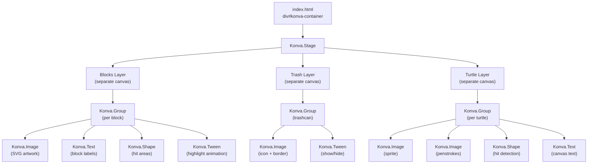
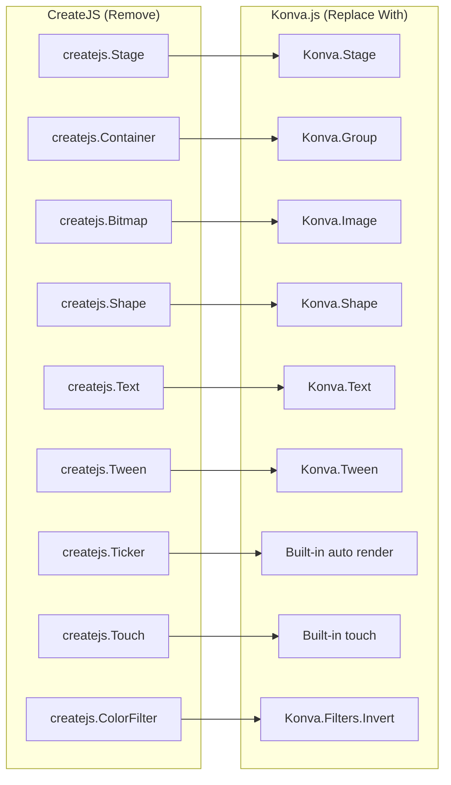
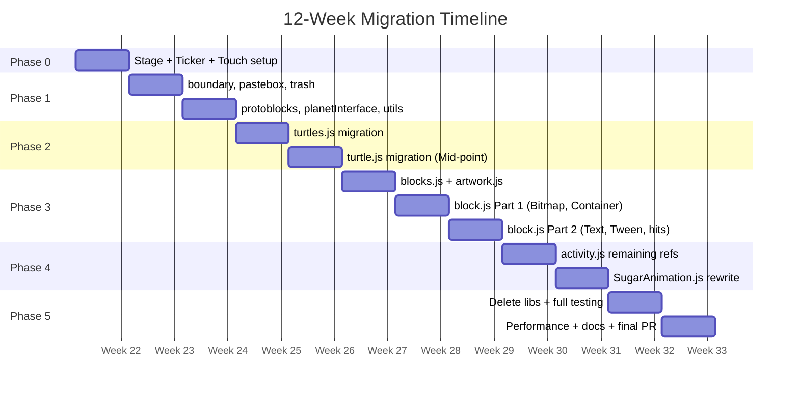
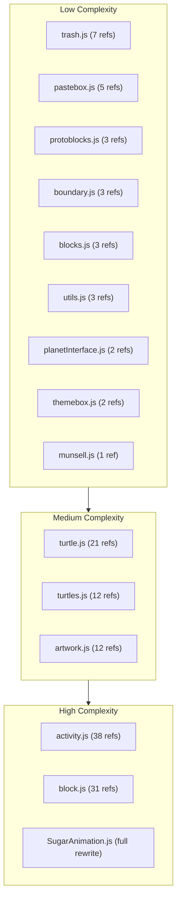

# Proposed Architecture: Konva.js Migration

## Solution Architecture

```mermaid
graph TD
    A["index.html<br/>div#konva-container"] --> B["Konva.Stage"]
    B --> C["Blocks Layer<br/>(separate canvas)"]
    B --> D["Trash Layer<br/>(separate canvas)"]
    B --> E["Turtle Layer<br/>(separate canvas)"]

    C --> C1["Konva.Group<br/>(per block)"]
    C1 --> C2["Konva.Image<br/>(SVG artwork)"]
    C1 --> C3["Konva.Text<br/>(block labels)"]
    C1 --> C4["Konva.Shape<br/>(hit areas)"]
    C1 --> C5["Konva.Tween<br/>(highlight animation)"]

    D --> D1["Konva.Group<br/>(trashcan)"]
    D1 --> D2["Konva.Image<br/>(icon + border)"]
    D1 --> D3["Konva.Tween<br/>(show/hide)"]

    E --> E1["Konva.Group<br/>(per turtle)"]
    E1 --> E2["Konva.Image<br/>(sprite)"]
    E1 --> E3["Konva.Image<br/>(penstrokes)"]
    E1 --> E4["Konva.Shape<br/>(hit detection)"]
    E1 --> E5["Konva.Text<br/>(canvas text)"]
```

## API Migration Map

```mermaid
graph LR
    subgraph Remove["CreateJS (Remove)"]
        S1["createjs.Stage"]
        S2["createjs.Container"]
        S3["createjs.Bitmap"]
        S4["createjs.Shape"]
        S5["createjs.Text"]
        S6["createjs.Tween"]
        S7["createjs.Ticker"]
        S8["createjs.Touch"]
        S9["createjs.ColorFilter"]
    end

    subgraph Add["Konva.js (Replace With)"]
        K1["Konva.Stage"]
        K2["Konva.Group"]
        K3["Konva.Image"]
        K4["Konva.Shape"]
        K5["Konva.Text"]
        K6["Konva.Tween"]
        K7["Built-in auto render"]
        K8["Built-in touch"]
        K9["Konva.Filters.Invert"]
    end

    S1 --> K1
    S2 --> K2
    S3 --> K3
    S4 --> K4
    S5 --> K5
    S6 --> K6
    S7 --> K7
    S8 --> K8
    S9 --> K9
```

## Migration Phases

```mermaid
gantt
    title 12-Week Migration Timeline
    dateFormat  YYYY-MM-DD
    axisFormat  Week %W

    section Phase 0
    Stage + Ticker + Touch setup         :a1, 2026-06-01, 1w

    section Phase 1
    boundary, pastebox, trash             :a2, after a1, 1w
    protoblocks, planetInterface, utils   :a3, after a2, 1w

    section Phase 2
    turtles.js migration                  :a4, after a3, 1w
    turtle.js migration (Mid-point)       :a5, after a4, 1w

    section Phase 3
    blocks.js + artwork.js                :a6, after a5, 1w
    block.js Part 1 (Bitmap, Container)   :a7, after a6, 1w
    block.js Part 2 (Text, Tween, hits)   :a8, after a7, 1w

    section Phase 4
    activity.js remaining refs            :a9, after a8, 1w
    SugarAnimation.js rewrite             :a10, after a9, 1w

    section Phase 5
    Delete libs + full testing            :a11, after a10, 1w
    Performance + docs + final PR         :a12, after a11, 1w
```

## Files by Migration Complexity

```mermaid
graph TD
    subgraph High["High Complexity"]
        H1["activity.js (38 refs)"]
        H2["block.js (31 refs)"]
        H3["SugarAnimation.js (full rewrite)"]
    end

    subgraph Medium["Medium Complexity"]
        M1["turtle.js (21 refs)"]
        M2["turtles.js (12 refs)"]
        M3["artwork.js (12 refs)"]
    end

    subgraph Low["Low Complexity"]
        L1["trash.js (7 refs)"]
        L2["pastebox.js (5 refs)"]
        L3["protoblocks.js (3 refs)"]
        L4["boundary.js (3 refs)"]
        L5["blocks.js (3 refs)"]
        L6["utils.js (3 refs)"]
        L7["planetInterface.js (2 refs)"]
        L8["themebox.js (2 refs)"]
        L9["munsell.js (1 ref)"]
    end

    Low --> Medium --> High
```
